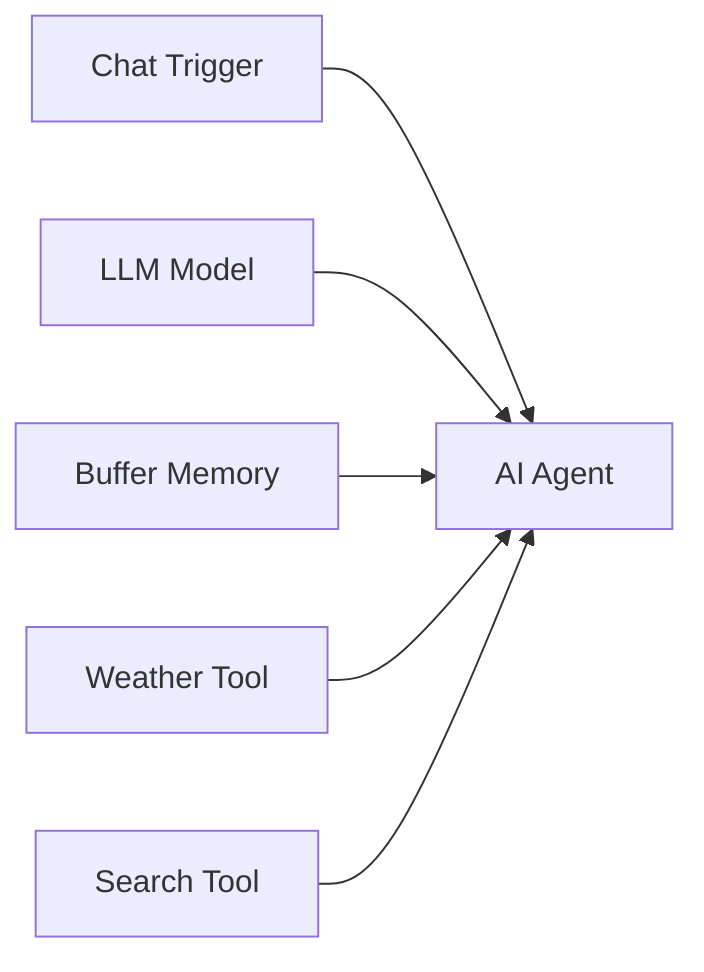

# n8n Workflow Patterns & Templates

n8n에서 자주 사용되는 검증된 워크플로우 디자인 패턴입니다.

## 🤖 AI Agent Pattern (LangChain)
제주도 날씨를 묻거나, 최신 뉴스를 요약하는 등의 지능형 봇을 만들 때 사용합니다.

### 기본 구조
1. **Chat Trigger**: 사용자 입력을 받습니다.
2. **AI Agent Node**: 워크플로우의 '두뇌'입니다.
   - **Model**: LLM 모델 연결 (OpenAI, Gemini, Anthropic 등)
   - **Memory**: 대화 맥락 기억 (`Window Buffer Memory` 등)
   - **Tools**: 에이전트가 사용할 도구 연결 (`HTTP Request Tool`, `Calculator`, `Code Tool`)

### 연결 예시

---

## 🔁 Looping Pattern (반복 처리)
대량의 데이터를 하나씩 또는 묶음으로 처리할 때 사용합니다.

### Loop Over Items (`n8n-nodes-base.splitInBatches`)
- **구 Split In Batches** 노드의 새 이름입니다.
- **Batch Size**: `1`로 설정하면 항목을 하나씩 순서대로 처리합니다.
- **Loop End**: 모든 항목 처리가 끝나면 자동으로 `Done` 경로(회색 화살표)로 나갑니다. 별도의 IF 노드로 종료 조건을 만들 필요가 없습니다.

### Rate Limiting (API 호출 제한)
API 속도 제한(예: 1초에 5회)을 준수해야 할 때 필수적입니다.
1. `Loop Over Items` (Batch Size: 5/10 등 설정)
2. `API Request Node` (실제 작업)
3. `Wait Node` (예: 1초 대기)
4. 다시 Loop로 연결

---

## 🛡️ Error Handling Pattern (오류 처리)
워크플로우가 실패했을 때 알림을 받거나 복구 작업을 수행합니다.

### Error Trigger (`n8n-nodes-base.errorTrigger`)
- **별도의 워크플로우**로 생성합니다.
- 어떤 워크플로우든 실패(Fail)하면 이 트리거가 실행됩니다.
- 실행된 워크플로우의 ID, 에러 메시지 등을 받아 Slack이나 Email로 알림을 보낼 수 있습니다.

### 개별 노드 "Continue On Fail"
- 노드 설정(Settings) 탭에서 `Continue On Fail`을 켜면, 해당 노드가 에러가 나도 멈추지 않고 다음 노드로 진행합니다.
- 출력 데이터에 `error` 속성이 포함됩니다.

---

## 🔗 Sub-workflow Pattern
복잡한 워크플로우를 모듈화합니다.

### Execute Workflow (`n8n-nodes-base.executeWorkflow`)
- 다른 워크플로우를 함수처럼 호출합니다.
- **장점**:
  1. 복잡도 감소: 메인 로직과 세부 로직 분리
  2. 재사용성: 로그인 처리, 공통 알림 발송 등을 하나의 워크플로우로 만들어 여러 곳에서 호출
  3. 메모리 절약: 서브 워크플로우는 실행 후 메모리에서 해제됨 (대량 데이터 처리에 유리)
